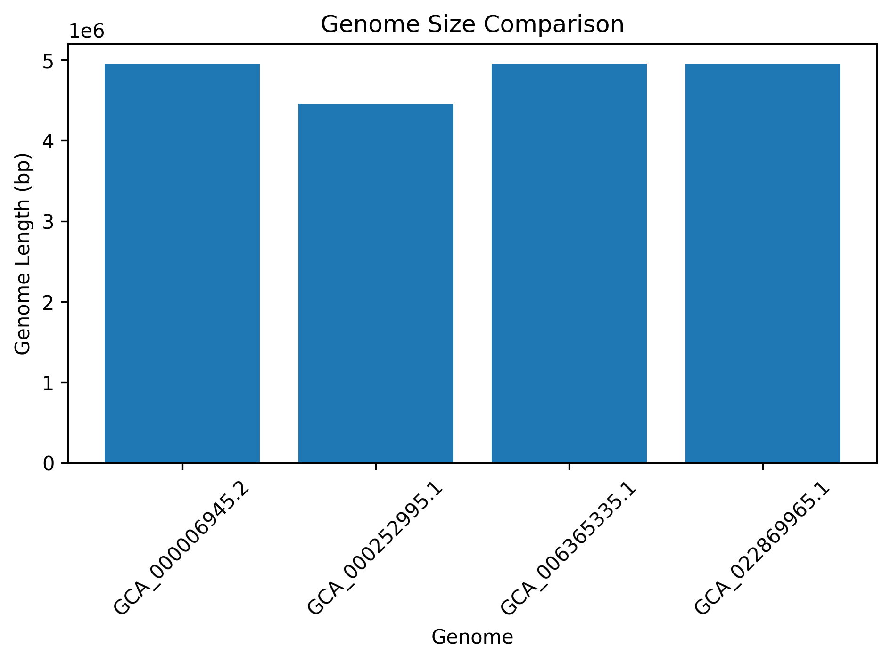

# Python-Based Comparative Genomics of *Salmonella* Strains

## Overview

This project presents a comparative analysis of four *Salmonella* genome sequences obtained from the National Center for Biotechnology Information (NCBI).

Python was used to analyze nucleotide composition, genome size, and GC content across the selected genomes.

## Objectives

- Analyze publicly available *Salmonella* genome sequences.
- Calculate genome length.
- Determine A, T, G, and C nucleotide composition.
- Calculate GC content.
- Compare genome characteristics among the selected strains.
- Visualize genome size and GC-content differences.

## Data Source

Genome sequences were obtained from the NCBI database in FASTA format.

### Genome accessions analyzed

| Genome | Genome length (bp) | GC content (%) |
|---|---:|---:|
| GCA_000006945.2 | 4,951,383 | 52.24 |
| GCA_000252995.1 | 4,460,105 | 51.33 |
| GCA_006365335.1 | 4,954,783 | 52.22 |
| GCA_022869965.1 | 4,951,425 | 52.24 |

## Methods

1. Genome sequences were downloaded from NCBI.
2. FASTA files were processed using Python.
3. Nucleotide sequences were extracted while excluding FASTA header lines.
4. A, T, G, and C nucleotide counts were calculated.
5. Genome length was calculated from the sequence.
6. GC content was calculated as:

   **GC content (%) = (G + C) / total nucleotides × 100**

7. Results were visualized using bar graphs.

## Tools Used

- NCBI
- Python
- Google Colab
- Pandas
- Matplotlib
- GitHub

## Results

The analyzed genomes showed GC contents ranging from **51.33% to 52.24%**.

The genome sizes ranged from approximately **4.46 Mb to 4.95 Mb**.

The results demonstrate how simple computational approaches can be used to compare genomic characteristics among bacterial strains.

## Visualizations

### GC Content Comparison

### Genome Size Comparison

## Project Files

- `NCBI_Bacterial_Genome_Analysis.ipynb` — Python/Google Colab analysis
- `genome_results.csv` — summarized results
- `gc_content_comparison.png` — GC-content graph
- `genome_size_comparison.png` — genome-size graph

## Future Work

Future analyses could include genome annotation, gene prediction, antimicrobial resistance gene screening, virulence-factor analysis, and comparative genomic analysis of additional *Salmonella* strains.
